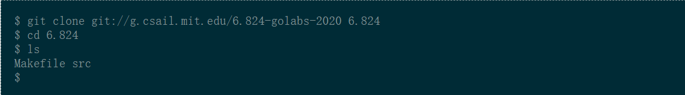
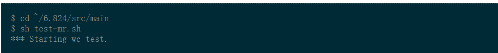
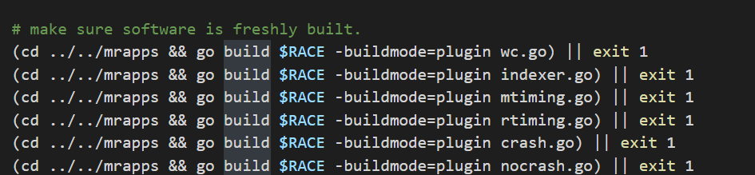
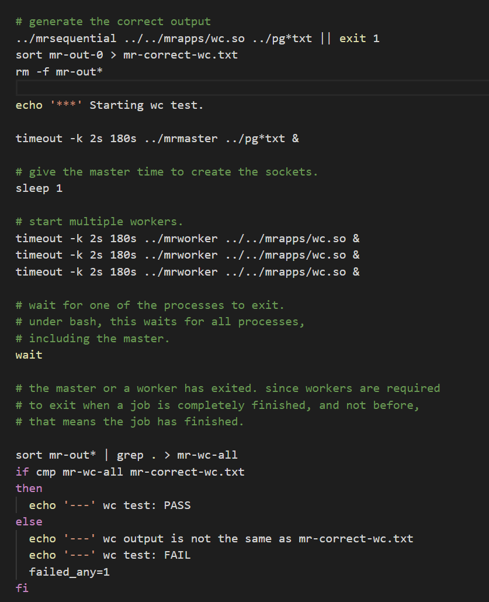
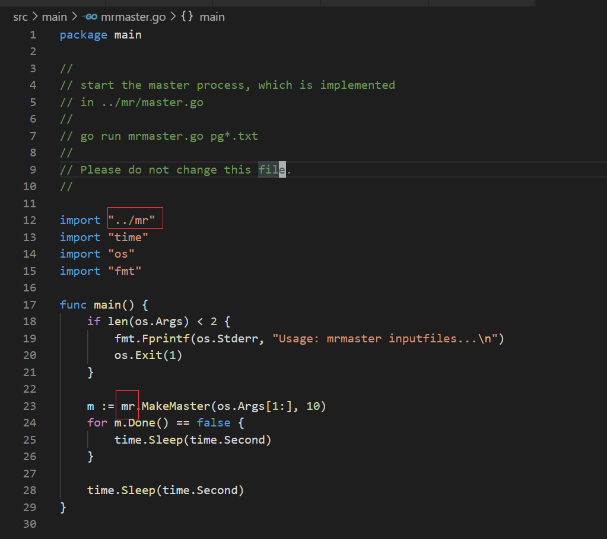
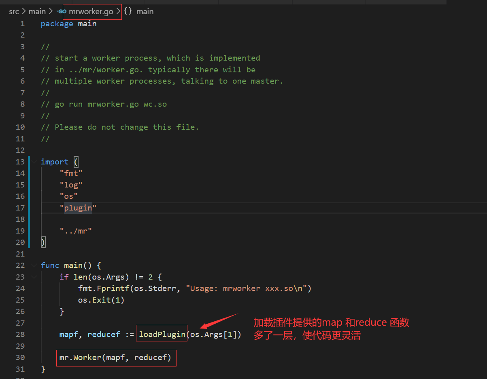

## Maprecude

## 实现思路

1. master起rpc服务对外注册RegWorker,ReqTask,ReportTask rpc调用
2. master维护工作列表和工作阶段，worker来要之后给，要处理woker宕机的情况
3. worker注册到master 索取工作，干，报告给master

## 数据结构

* master
  * files // 初始任务
  * ~~workerIDSlice //workerid~~
  * taskStats TaskStat
  * nMaps   // mr-mapIdx-reduceIdx.map len(files)
  * nReduce //  mr-reduceIdx
  * taskphase 
  * taskCh
  * done
  * mu
* TaskStat
  * Status
    * TaskStatusReady //初始状态，生成相应的task之后进入队列
    * TaskStatusQueue
    * TaskStatusRunning
    * TaskStatusErr
  * WorkerID
  * StartTime
* time
  * MaxTaskRunTime 
  * ScheduleInterval 
* worker
  * workerID
  * ~~taskPhase~~
  * ~~filenames~~ 这两个可以用Task来包装过来
  * maf     func(string,string)[]KeyValue
  * reducef func(string,[]string)string
* KeyValue
  * Key string
  * Value string
* Task
  * Seq //对应taskStatusSlice中的下标
  * Phase // Map or Reduce
  * Filename // 具体任务 map阶段用 Reduce阶段用 NMaps+TaskID就可以构造出相对的名字
  * NReduce
  * NMpas
  * Alive bool // worker should exit when alive is false
* TaskPhase
  * MapPhase
  * ReducePhase
* RPC
  * request task
    * ReqTaskArgs
    * ReqTaskReply
  * register worker
    * RegisterWorkerArgs
    * RegisterWorkerReply
  * report task
    * ReportTaskArgs
    * ReportTaskReply

### 动作实例以及函数

* Master
  * MakeMaster()*Master 
    * server
    * initMapTask
    * go tickSchedule ->shcedule()
  * server() 启rpc监听
  * RPC函数
    * RegWorker
    * GetOneTask ->regTask reply one task to worker
    * ReportTask
  * initMapTask
  * initReduceTask
  * getTask  make a task
* Worker
  * Worker() called by main/mrworker.go
  * register()
  * run
    * reqTask
    * doTask
      * doMapTask
      * doReduceTask
      * reportTask


## 相关资料

[MIT6.824视频](https://www.bilibili.com/video/av91748150)


[根据Lab1 6.824代码明确任务](https://pdos.csail.mit.edu/6.824/labs/lab-mr.html)





测试逻辑



> 期间遇到了一个坑，go plugin debug模式的时候在build的时候需要加入特殊的参数
>
> `go build -gcflags='all=-N -l' `

```bash
go build -gcflags='all=-N -l' -buildmode=plugin ../mrapps/wc.go

```




``` bash
.
├── Makefile
├── readme.md
└── src
    ├── main
    │   ├── mrmaster
    │   ├── mrmaster.go
    │   ├── mrsequential.go
    │   ├── mrworker
    │   ├── mrworker.go
    │   ├── pbc.go
    │   ├── pbd.go
    │   ├── pg-being_ernest.txt
    │   ├── pg-dorian_gray.txt
    │   ├── pg-frankenstein.txt
    │   ├── pg-grimm.txt
    │   ├── pg-huckleberry_finn.txt
    │   ├── pg-metamorphosis.txt
    │   ├── pg-sherlock_holmes.txt
    │   ├── pg-tom_sawyer.txt
    │   ├── test-mr.sh
    ├── mr
    │   ├── common.go
    │   ├── master.go
    │   ├── rpc.go
    │   └── worker.go
    ├── mrapps
    │   └── wc.go //正常的map reduce 函数
    │   ├── crash.go // check implementation recovers from workers that crash while 
    │   ├── nocrash.go
    │   ├── mtiming.go // check implementation runs the Map and Reduce tasks in parallel
    │   ├── rtiming.go 
    │   ├── indexer.go // 
```
[学习别人的实现](https://github.com/yzongyue/6.824-golabs-2020)





### 任务的分配

> .
> ├── mr-0-0
> ├── mr-0-1
> ├── mr-0-2
> ├── mr-0-3
> ├── mr-0-4
> ├── mr-0-5
> ├── mr-0-6
> ├── mr-0-7
> ├── mr-0-8
> ├── mr-0-9
> ├── mr-1-0
> ├── mr-1-1
> ├── mr-1-2
> ├── mr-1-3
> ├── mr-1-4
> ├── mr-1-5
> ├── mr-1-6
> ├── mr-1-7
> ├── mr-1-8
> ├── mr-1-9
> .........
> ├── mr-7-0
> ├── mr-7-1
> ├── mr-7-2
> ├── mr-7-3
> ├── mr-7-4
> ├── mr-7-5
> ├── mr-7-6
> ├── mr-7-7
> ├── mr-7-8
> ├── mr-7-9
> ├── mr-correct-wc.txt
> ├── mr-out-0
> ├── mr-out-1
> ├── mr-out-2
> ├── mr-out-3
> ├── mr-out-4
> ├── mr-out-5
> ├── mr-out-6
> ├── mr-out-7
> ├── mr-out-8
> ├── mr-out-9
> └── mr-wc-all


### 具体的master 和worker实现

【】【】【】【】【】【】【】【】 | 【】【】


## [Tidb版本Mapreduce](https://github.com/pingcap/talent-plan/tree/master/tidb/mapreduce)

## Introduction

There is a uncompleted Map-Reduce framework, you should complete it and use it to extract the **10 most frequent URLs** from data files.

## 遇到的问题

1. go plugin模式需要在linux环境下使用

2. 想把实验室的台式机上的linux做成一个远程开发的服务器，通过vscode来远程开发，如果能在寝室、教室、家里也能连接那就相当的香了

   * 如何让寝室的网络能连接这个服务器
   * 针对上面的这个问题，想通过302vpn来像实验室服务器一样实现能用vpn访问
   * 但是在连了302vpn，打开v2ray客户端用switchomega的情况下会出现不能访问google的情况（控制面板里面把“在远程网络上使用默认网关”关闭就OK）

  


